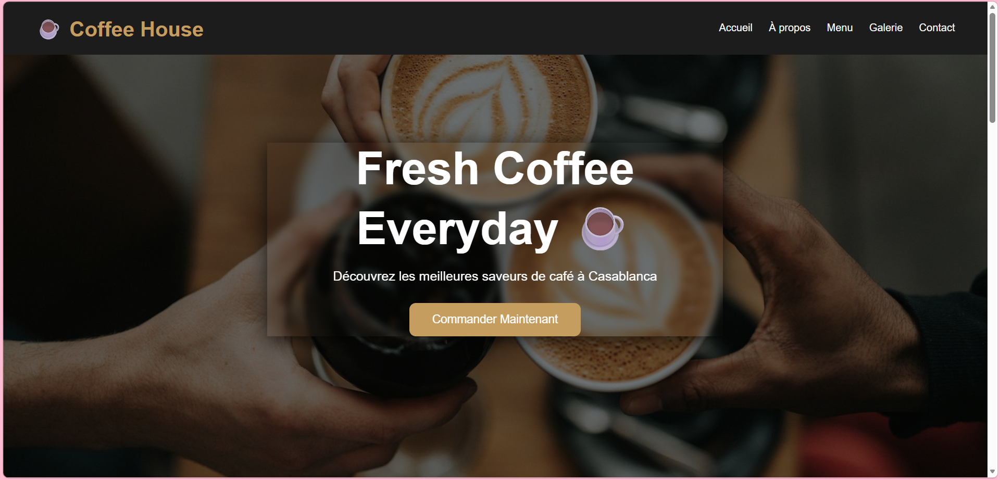
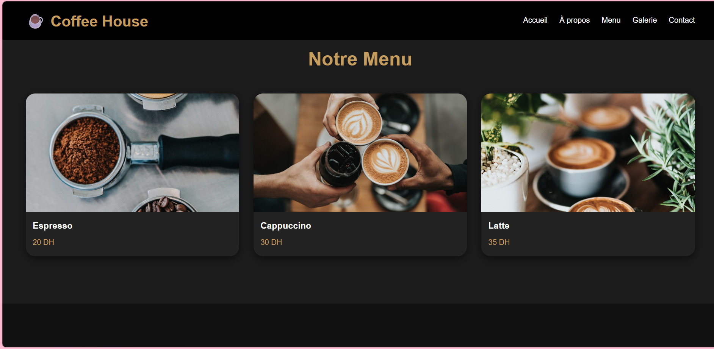
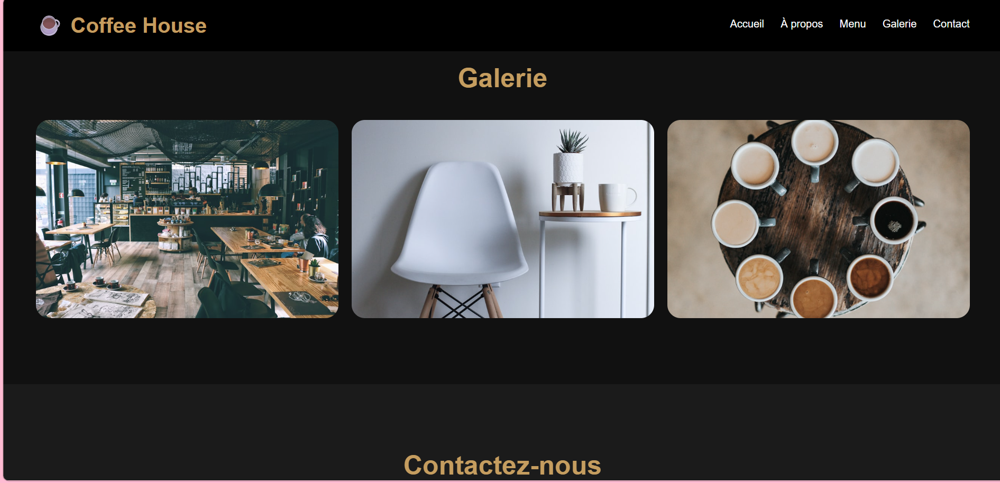
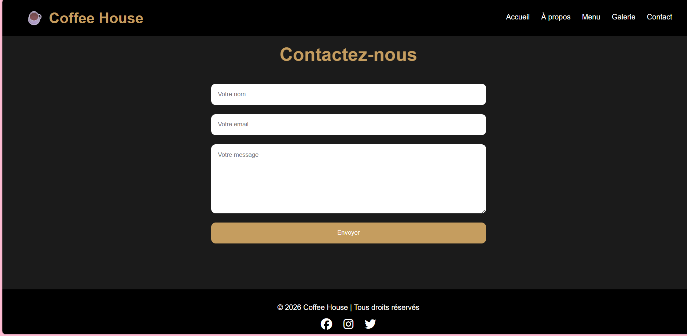

# ☕ Coffee House Website

## 📌 Description
This is a modern coffee shop website built using HTML, CSS, and JavaScript.  
It includes a menu, gallery, contact form, and responsive design.

---

## 🛠 Technologies Used
- HTML5
- CSS3
- JavaScript (DOM, Events)

---

## 🎯 Features
- Responsive design (mobile + desktop)
- Interactive navigation menu
- Scroll animations
- Contact form with message alert
- Modern UI design

---

## 👩‍💻 Author
Created by: Khadija Ataimin

---

## 📸 Preview

